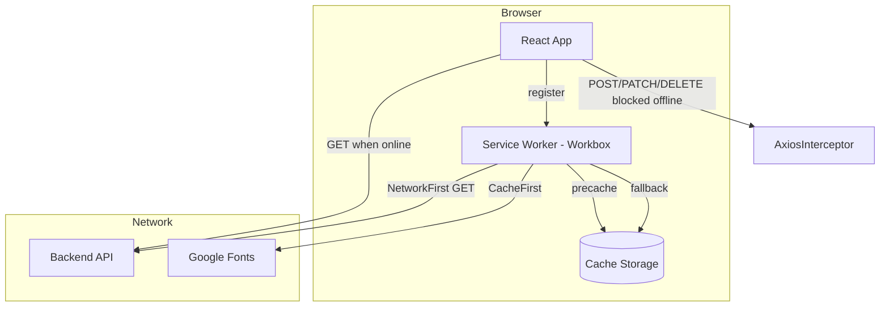

# ResourceHub PWA — Implementation Notes

This document describes how Progressive Web App (Pwa) support was added to ResourceHub, the reasoning behind each decision, and what was intentionally **not** implemented.

## Scope

ResourceHub PWA support covers three goals:

| Goal | Implemented | Notes |
|------|-------------|-------|
| **Offline read access** | Yes | Cached app shell + previously fetched GET data |
| **Installable app** | Yes | Web manifest + install prompt |
| **Offline sync / write queue** | **No** | Writes are blocked while offline |

When offline, create, edit, delete, login, logout, and other write operations are rejected with a clear message. There is no background sync or mutation queue.

---

## Architecture overview



**Stack:** [Vite 7](https://vite.dev/) + [vite-plugin-pwa](https://vite-pwa-org.netlify.app/) (Workbox under the hood).

**Why vite-plugin-pwa?** It integrates cleanly with the existing Vite build, generates the service worker at build time, injects the web manifest, and exposes a typed `virtual:pwa-register` module — no manual Workbox configuration files to maintain.

---

## 1. Service worker and caching

**Files:** `vite.config.js`, `src/main.jsx`

### Plugin configuration

```js
VitePWA({
  registerType: 'autoUpdate',
  includeAssets: [...],
  manifest: { ... },
  workbox: { ... },
})
```

### `registerType: 'autoUpdate'`

**What it does:** When a new build is deployed, the service worker updates silently in the background and activates on the next visit.

**Why:** ResourceHub is a content app, not a real-time editor. Silent updates avoid prompting users on every deploy while still keeping caches fresh. A `prompt`-based strategy could be added later if breaking cache changes need user confirmation.

### Service worker registration (`main.jsx`)

```js
import { registerSW } from 'virtual:pwa-register'

registerSW({
  immediate: true,
  onOfflineReady() {
    console.info('ResourceHub is ready to work offline.')
  },
})
```

**Why `immediate: true`:** Registers the SW as soon as the app loads rather than waiting for `load`. Earlier registration means precaching starts sooner on repeat visits.

**Why only in production builds:** vite-plugin-pwa injects the service worker during `vite build`. It is not active during `npm run dev` unless `devOptions.enabled` is set (intentionally left off to avoid dev/cache confusion).

---

## 2. Precaching (app shell)

**File:** `vite.config.js` → `workbox.globPatterns`

```js
globPatterns: ['**/*.{js,css,html,ico,png,svg,woff2,txt,xml}']
```

**What it does:** At build time, Workbox hashes and precaches all matched static assets from `dist/` — HTML, JS chunks, CSS, icons, `offline.html`, etc.

**Why:** This is the foundation of offline support. Once a user visits while online, the core application bundles are stored locally. On a later offline visit, the app shell can boot without network access.

**SPA navigation fallback:**

```js
navigateFallback: '/index.html',
navigateFallbackDenylist: [/^\/api\//, /^\/offline\.html$/],
```

**Reasoning:**
- React Router handles client-side routes. Offline navigations to paths like `/publicResources` or `/collections/user/slug` must receive `index.html`, not a 404 from the server.
- `/api/` is denylisted because API calls should never be rewritten to the SPA shell.
- `/offline.html` is denylisted so the dedicated static offline page is served directly when requested, not replaced by the React shell.

---

## 3. Runtime caching strategies

### Google Fonts — `CacheFirst`

```js
urlPattern: /^https:\/\/fonts\.googleapis\.com\/.*/i  // stylesheets
urlPattern: /^https:\/\/fonts\.gstatic\.com\/.*/i     // font files
```

**Why CacheFirst:** Font files are immutable and rarely change. Serving from cache first avoids layout shifts and speeds up offline renders. Fonts are loaded from `index.css` via `@import`; without this, offline pages would fall back to system fonts.

### Backend GET requests — `NetworkFirst`

```js
urlPattern: ({ request, url }) =>
  request.method === 'GET' && url.href.startsWith(backendOrigin)
handler: 'NetworkFirst'
networkTimeoutSeconds: 8
maxEntries: 80
maxAgeSeconds: 86400  // 24 hours
```

**What it does:** For GET requests to the backend origin (derived from `VITE_BACKEND_URL`), try the network first. If the network fails or times out after 8 seconds, serve the last cached response.

**Why NetworkFirst (not CacheFirst):** Users should see fresh data when online. Cache is a fallback for offline/read-only browsing, not the primary source of truth.

**Why GET only:** POST, PATCH, PUT, and DELETE are never cached by this rule. This aligns with the no-sync policy — mutations always require a live connection.

**Why scope to `backendOrigin`:** The auth service (`VITE_AUTH_URL`) is a separate origin and is not cached. OAuth/login flows require network access by design.

**Why 80 entries / 24h TTL:** Bounded cache size prevents unbounded storage growth on devices while keeping a reasonable window of previously viewed resources and collections.

---

## 4. Web app manifest (installability)

**Files:** `vite.config.js` (manifest block), `index.html` (Apple meta tags)

```js
manifest: {
  name: 'ResourceHub',
  short_name: 'ResourceHub',
  display: 'standalone',
  start_url: '/',
  theme_color: '#1e293b',
  background_color: '#fafaf9',
  icons: [ /* 192, 512, maskable */ ],
}
```

**Why `display: 'standalone'`:** Hides the browser chrome when launched from the home screen, making the installed app feel native.

**Why shared logo for all icon sizes:** Only one icon asset (`resourceManagerLogo.png`) exists today. Using it for 192/512/maskable avoids shipping incomplete manifest icons. Dedicated sized icons can be added later for sharper home-screen appearance.

**Apple-specific tags in `index.html`:**

```html
<meta name="apple-mobile-web-app-capable" content="yes" />
<meta name="apple-mobile-web-app-title" content="ResourceHub" />
<link rel="apple-touch-icon" href="/resourceManagerLogo.png" />
```

**Why:** Safari on iOS does not use the standard `beforeinstallprompt` flow. These tags enable Add to Home Screen with a proper title and icon.

---

## 5. Install prompt

**File:** `src/components/InstallPrompt.jsx`

**What it does:**
1. Listens for the browser `beforeinstallprompt` event (Chrome, Edge, Android).
2. Shows a dismissible card: "Install ResourceHub".
3. Calls `deferredPrompt.prompt()` when the user taps Install.
4. Hides itself if already installed (`display-mode: standalone`) or dismissed (`localStorage` key).

**Why a custom prompt instead of the browser default:** Calling `event.preventDefault()` on `beforeinstallprompt` suppresses the native mini-infobar and lets us control timing and styling. The prompt only appears when the browser has already determined the app is installable.

**Why dismiss is persisted:** Avoids nagging returning users who chose "Not now".

**iOS limitation:** iOS Safari does not fire `beforeinstallprompt`. Users must manually use Share → Add to Home Screen. The Apple meta tags above support that path.

---

## 6. Offline write blocking (no sync engine)

Write blocking is enforced at three layers for defense in depth.

### Layer 1 — Axios request interceptor

**File:** `src/utilis/Axios.jsx`

Blocks all non-GET requests through `axiosInstance` when offline and shows a toast:

> Write operations are not supported while offline. Reconnect to create, edit, or delete.

**Why at the HTTP layer:** Every backend mutation flows through `axiosInstance`. One interceptor covers resources, collections, bookmarks, documents, and user bootstrap — without updating every form individually.

**Why not queue mutations:** Queuing offline writes requires conflict resolution, idempotency guarantees, rollback UX, and sync status UI. That was explicitly out of scope. Blocking is simpler and avoids silent data loss.

### Layer 2 — Module-level network flag

**Files:** `src/utilis/networkStatus.js`, `src/context/OnlineStatusContext.jsx`

`OnlineStatusProvider` listens to `window.online` / `window.offline` and syncs a module-level flag via `setNetworkOnline()`.

**Why a module-level flag outside React:** Axios interceptors run outside the component tree and cannot call hooks. The shared module bridges React state and imperative HTTP code.

### Layer 3 — UI guards

**Files:** `src/hooks/useOfflineGuard.js`, `src/components/OfflineBanner.jsx`, `src/components/Navbar.jsx`

- **`OfflineBanner`:** Sticky amber banner at the top when offline. Sets user expectations before they attempt a write.
- **`useOfflineGuard`:** Used in Navbar for Add Resource, login, and logout — disables buttons and shows the same toast message on click.

**Why UI guards if Axios already blocks:** Prevents confusing flows (e.g. opening the create form, filling it out, then failing on submit). Disabling entry points is better UX than failing at the last step.

**What is not guarded:** Direct navigation to `/createResource` or `/edit/:id` while offline still loads the form, but submit will fail at the Axios layer. A future improvement could redirect write routes to home when offline.

---

## 7. Offline page for uncached routes

**Problem:** Precaching stores bundles that were generated at build time. Lazy-loaded route chunks (e.g. `CollectionDetail.jsx`) are only cached **after the user has visited that route at least once while online**. If a user goes offline and navigates to an uncached route, the dynamic `import()` fails.

**Files:**
| File | Role |
|------|------|
| `public/offline.html` | Static fallback page — no JS required |
| `src/pages/Offline.jsx` | React version at `/offline` for in-app use |
| `src/utilis/lazyWithOfflineFallback.js` | Wraps all `lazy()` imports |
| `src/components/RouteErrorBoundary.jsx` | Catches chunk errors during render |

### Static `offline.html`

Self-contained HTML with inline CSS, precached via `includeAssets`.

**Why static instead of only a React route:** If the lazy chunk for a route fails to load, other lazy chunks (Navbar, Footer) may also be unavailable. A static page guaranteed to be in the precache manifest always renders.

**User action:** "Go to Home" links to `/`, which is typically cached after any prior visit.

### `lazyWithOfflineFallback`

Wraps every `lazy(() => import(...))` in `App.jsx`. On chunk load failure while offline → `window.location.replace('/offline.html')`.

Also registers a global `unhandledrejection` handler as a safety net for chunk errors outside the lazy wrapper.

### React `/offline` route

Eagerly imported (not lazy) so it is always in the main bundle. Auto-redirects to `/` when the user comes back online.

**Why both `/offline` and `/offline.html`:** Static HTML is the reliable fallback for chunk failures. The React route provides a consistent in-app experience when the shell is already loaded.

---

## 8. File reference

| File | Purpose |
|------|---------|
| `vite.config.js` | PWA plugin, manifest, Workbox caching rules |
| `src/main.jsx` | SW registration, `OnlineStatusProvider` |
| `src/App.jsx` | Offline banner, install prompt, lazy wrappers, `/offline` route |
| `src/vite-env.d.ts` | TypeScript types for `vite-plugin-pwa/client` |
| `index.html` | Apple PWA meta tags, theme color |
| `public/offline.html` | Static offline fallback |
| `src/pages/Offline.jsx` | React offline page |
| `src/utilis/lazyWithOfflineFallback.js` | Chunk failure → offline redirect |
| `src/utilis/networkStatus.js` | Online flag + write method helper |
| `src/utilis/Axios.jsx` | Write blocker interceptor |
| `src/context/OnlineStatusContext.jsx` | React online/offline state |
| `src/hooks/useOfflineGuard.js` | UI-level write guard hook |
| `src/components/OfflineBanner.jsx` | Offline status banner |
| `src/components/InstallPrompt.jsx` | Install card |
| `src/components/RouteErrorBoundary.jsx` | Chunk error boundary |

---

## 9. Testing

### Prerequisites

PWA features require **HTTPS** (or `localhost`). Service workers do not register on plain HTTP in production.

### Build and preview

```bash
npm run build
npm run preview
```

Open `http://localhost:4173` (or your preview URL).

### Verify service worker

1. Chrome DevTools → **Application** → **Service Workers** — should show a registered worker.
2. **Application** → **Cache Storage** — should list Workbox precache and runtime caches after browsing.

### Verify offline read

1. Visit `/` and `/publicResources` while online.
2. DevTools → **Network** → check **Offline**.
3. Reload — cached pages should render.
4. Navigate to a route you never visited online — should redirect to `/offline.html`.
5. Click **Go to Home** — home page should load from cache.

### Verify write blocking

1. While offline, try **Add Resource**, **Sign out**, or submit any form.
2. Expect a toast: "Write operations are not supported while offline…"
3. Offline banner should be visible at the top.

### Verify install

1. Chrome DevTools → **Application** → **Manifest** — check manifest fields.
2. Look for the install prompt card (bottom-right) or use the browser install icon in the address bar.
3. After installing, the prompt should not reappear.

---

## 10. Known limitations

1. **No offline sync** — Changes made offline are not saved or replayed. Users must reconnect to write.
2. **Cache is visit-dependent** — Pages and API data are only available offline if previously loaded while online.
3. **Auth does not work offline** — Google OAuth and the external auth service require network access.
4. **iOS install is manual** — No custom install prompt; users use Safari's Add to Home Screen.
5. **Dev server** — Service worker is not active during `npm run dev` by default.
6. **Auth service requests** — Logout uses plain `axios` to `VITE_AUTH_URL`; only Navbar guards block it in UI. The auth POST itself is not intercepted by `axiosInstance`.

---

## 11. Possible future improvements

- Dedicated PWA icons at 192×192 and 512×512 for sharper install appearance
- Redirect write routes (`/createResource`, `/edit/:id`, `/collections/new`) to home when offline
- `devOptions.enabled` in vite-plugin-pwa for local PWA testing during development
- Intercept auth-service axios calls with the same offline write blocker
- Background sync (only if product requirements change to support offline mutation queue)
